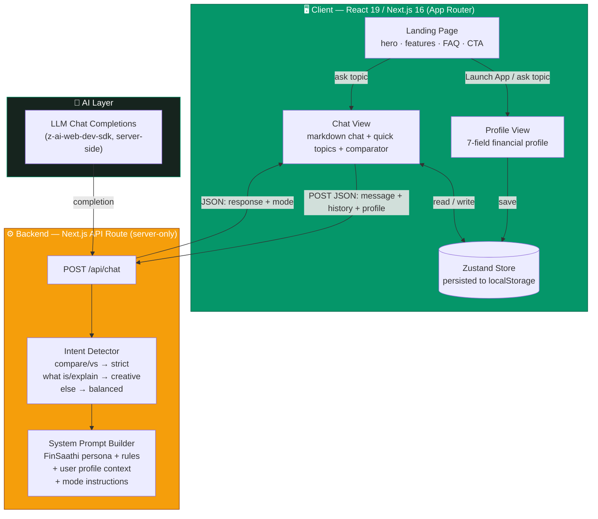
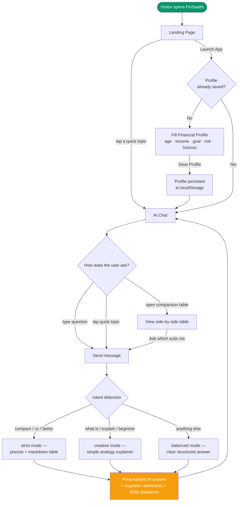
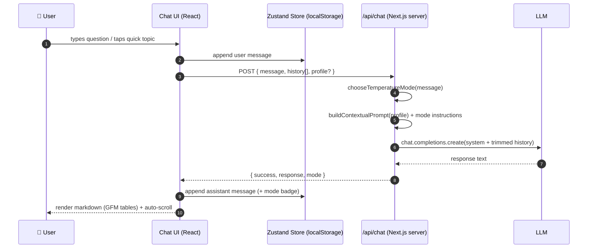

# FinSaathi 💰

> **Financial literacy, made simple for India.**
> An AI-powered financial literacy assistant for first-time Indian investors — now transformed from Streamlit to a modern **React (Next.js 16)** experience with a full landing page.

FinSaathi helps first-time investors understand mutual funds, insurance, government schemes, tax-saving concepts, and beginner financial planning in simple, jargon-free language — personalised to each user's profile, with references to Indian regulators such as **SEBI**, **AMFI**, and **IRDAI**.

---

## 🚀 What's New — v2 React Transformation

| | v1 (legacy) | v2 (this branch) |
|---|---|---|
| UI | Streamlit (Python-rendered) | **React 19 + Next.js 16 + Tailwind CSS 4 + shadcn/ui** |
| Pages | 1 app page, no landing | **Full landing page** (hero, features, how-it-works, comparisons, FAQ, CTA) + app views |
| Chat backend | Python `google-genai` SDK | **Next.js API route** (`/api/chat`) with server-side LLM SDK |
| Profile persistence | Streamlit session state (server memory) | **Zustand + localStorage** (survives refresh, stays on device) |
| Theming | Streamlit default | **Custom emerald/amber fintech design system**, dark-mode ready |
| Animations | None | **Framer Motion** micro-interactions |
| AI behaviour | Temperature presets | Same intent-based modes, ported 1:1 (strict / creative / balanced) |

The Streamlit version is kept untouched in this PR for reference — the new React app lives in [`web/`](./web).

## ✨ Features

- 🏠 **Landing page** — hero with live chat mockup, stats bar, 6 feature cards, 3-step "how it works", interactive comparison tables, tappable quick topics, scope grid, FAQ accordion, CTA and footer
- 👤 **Financial profile** — age, employment, income band, savings capacity, goal, risk comfort, investment horizon; saved to `localStorage` and injected into every AI answer
- 💬 **AI Chat** — multi-turn conversation with full memory, markdown + GFM table rendering, intent-based response modes, thinking indicator, reset
- 📊 **Quick comparisons** — Term vs ULIP, SIP vs Lumpsum, ELSS vs PPF as side-by-side tables (on the landing page *and* inside chat)
- ⚡ **Quick topics** — five one-tap starter questions, from landing page straight into chat
- 🛡️ **Educational safety** — no product recommendations, regulator references, SEBI-advisor disclaimer throughout

## 🏗️ Architecture



## 🔄 User Flow



## 💬 Chat Request Lifecycle



## 🧱 Tech Stack

| Layer | Technology |
|---|---|
| Framework | **Next.js 16** (App Router) + React 19 + TypeScript 5 |
| Styling | Tailwind CSS 4 + shadcn/ui (New York) + custom emerald/amber theme |
| State | Zustand 5 with `persist` middleware (localStorage) |
| Animation | Framer Motion 12 |
| Markdown | react-markdown + remark-gfm (renders AI comparison tables) |
| AI | z-ai-web-dev-sdk via server-side API route (replaces Gemini client) |
| Legacy v1 | Streamlit + google-genai (kept in repo root) |

## 📁 Project Structure

```text
finsathi.ai/
├── README.md                  # This file — docs, diagrams, setup
├── app.py                     # v1 Streamlit entry point (legacy)
├── components/                # v1 Streamlit UI components (legacy)
├── core/                      # v1 chat engine, Gemini client, prompts (legacy)
├── config/                    # v1 settings (legacy)
└── web/                       # 🆕 v2 React application
    ├── package.json
    ├── next.config.ts
    ├── src/
    │   ├── app/
    │   │   ├── page.tsx           # Landing ⇄ Profile ⇄ Chat view switcher
    │   │   ├── layout.tsx         # Fonts (Geist + Outfit), metadata
    │   │   ├── globals.css        # FinSaathi emerald/amber design system
    │   │   └── api/chat/route.ts  # Chat backend (LLM + intent modes)
    │   ├── components/finsathi/
    │   │   ├── landing.tsx        # Header, hero, stats, footer
    │   │   ├── landing-sections.tsx # Features, how-it-works, comparisons, FAQ, CTA
    │   │   ├── profile-view.tsx   # Financial profile form + summary
    │   │   ├── chat-view.tsx      # Chat UI with quick topics + comparator
    │   │   ├── comparator.tsx     # Comparison tables (shared)
    │   │   └── logo.tsx
    │   └── lib/finsathi/
    │       ├── data.ts            # Comparisons, quick topics, profile options
    │       ├── prompts.ts         # System prompt + intent→mode logic (ported)
    │       ├── store.ts           # Zustand persisted store
    │       └── types.ts
    └── public/
```

## 🛠️ Run the React app (v2)

```bash
cd web
bun install        # or: npm install
bun run dev        # or: npm run dev
```

Open http://localhost:3000 — no API keys or environment variables are required; the chat backend is wired out of the box.

> Optional: copy `web/.env.example` to `web/.env` if you want to override the app name.

## 🛠️ Run the legacy Streamlit app (v1)

```bash
pip install -r requirements.txt
cp .env.example .env          # add your GEMINI_API_KEY
streamlit run app.py
```

## 🧪 Verified Flows

- Landing page renders fully (hero, features, how-it-works, interactive comparisons, quick topics, scope, FAQ, CTA, footer) — desktop & mobile
- Launch App → fill profile → Save → persisted across reloads
- Quick topic tap on landing → jumps into chat → answer streams with mode badge
- Chat answers include markdown tables (GFM), regulator references and the SEBI-advisor disclaimer
- Comparison tables (Term vs ULIP, SIP vs Lumpsum, ELSS vs PPF) on landing and in chat sidebar

## 📺 Demo

> Loom recording (v1): https://www.loom.com/share/930e239636624a08b97eabaed597bee1

Suggested demo flow:
1. Land on the new React landing page — tap a quick-topic chip
2. Watch the personalised answer arrive with a response-mode badge
3. Open **ELSS vs PPF** comparison, then ask *"Which is better for me, ELSS or PPF?"*
4. Fill the profile as a 25-year-old salaried user and ask again — see the answer adapt

## ⚠️ Disclaimer

FinSaathi provides educational information only. It is not financial, investment, tax, legal, or insurance advice. Please consult a SEBI-registered advisor before investing.

## 👥 Team

Built for the **Flowzint Hackathon 2026**.
